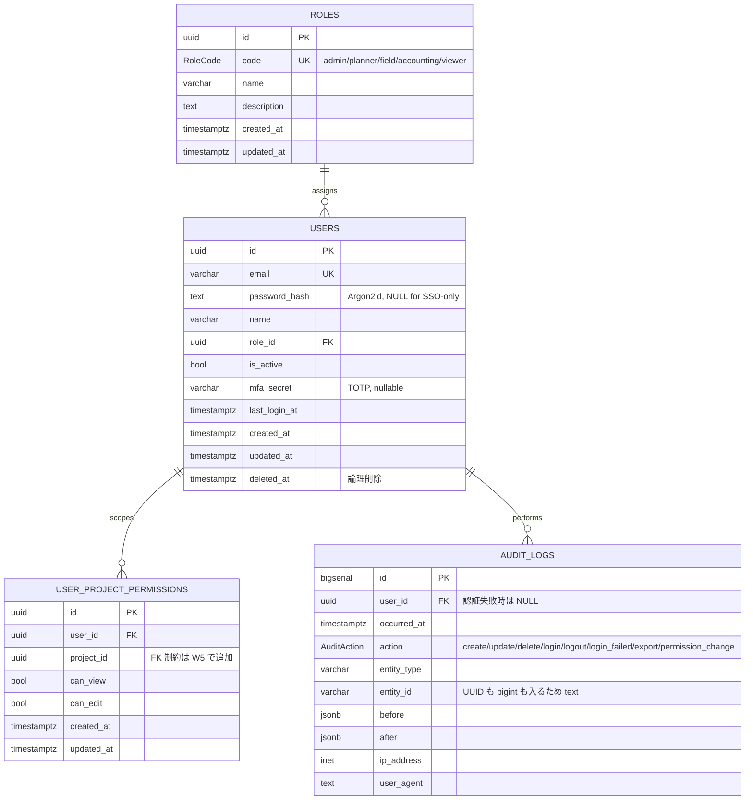

# データモデル — 認証・認可・監査ログ

W2 (T9) で追加されたテーブル群の参照ドキュメント。
正本は [`apps/api/prisma/schema.prisma`](../apps/api/prisma/schema.prisma)、
マイグレーションは `apps/api/prisma/migrations/20260516080915_add_auth_tables/`。

---

## ER 図

---

## テーブル詳細

### `roles`
固定 5 ロールを seed で投入。新規ロールはアプリ側からは追加不可（DB 制約はないが、ガードロジック側で `RoleCode` enum に縛る）。

| カラム | 型 | 説明 |
|---|---|---|
| `id` | uuid v7 | PK |
| `code` | `RoleCode` | UK。`admin`/`planner`/`field`/`accounting`/`viewer` |
| `name` | varchar(50) | 日本語表示名 |
| `description` | text | 用途説明 |

### `users`
| カラム | 型 | 説明 |
|---|---|---|
| `id` | uuid v7 | PK |
| `email` | varchar(255) | UK。ログイン ID |
| `password_hash` | text? | Argon2id ハッシュ。**SSO ユーザは NULL** |
| `name` | varchar(100) | 表示名 |
| `role_id` | uuid FK→roles | 単一ロール |
| `is_active` | bool | 無効化フラグ |
| `mfa_secret` | varchar(255)? | TOTP 秘密鍵 |
| `last_login_at` | timestamptz? | 直近ログイン時刻 |
| `created_at` / `updated_at` | timestamptz | |
| `deleted_at` | timestamptz? | 論理削除 |

インデックス: `role_id`, `deleted_at`、`email` は UK 自動付与。

### `user_project_permissions`
工事単位の閲覧／編集権限。`projects` テーブルは W5 (T で言うと後続) で追加されるため、現時点では `project_id` は **FK 制約なしの UUID 参照**。W5 完了後に `ALTER TABLE ... ADD CONSTRAINT` する migration を追加する想定。

| カラム | 型 | 説明 |
|---|---|---|
| `id` | uuid v7 | PK |
| `user_id` | uuid FK→users | `ON DELETE CASCADE` |
| `project_id` | uuid | 工事 ID (FK は W5) |
| `can_view` | bool | デフォルト true |
| `can_edit` | bool | デフォルト false |

UK: `(user_id, project_id)`、追加 index: `project_id`。

### `audit_logs`
件数が大きくなるため `bigserial` PK。`user_id` 経由でユーザを引けるが、認証失敗時は NULL なので `Optional`。**append-only 運用**を NestJS リポジトリ層で担保（UPDATE/DELETE エンドポイントを設けない）。

| カラム | 型 | 説明 |
|---|---|---|
| `id` | bigserial | PK |
| `user_id` | uuid? FK→users | `ON DELETE SET NULL` |
| `occurred_at` | timestamptz | デフォルト `now()` |
| `action` | `AuditAction` | enum |
| `entity_type` | varchar(100)? | テーブル名相当 |
| `entity_id` | varchar(100)? | UUID/bigint 混在のため text |
| `before` / `after` | jsonb? | 変更前後の状態 |
| `ip_address` | inet? | クライアント IP |
| `user_agent` | text? | UA 文字列 |

インデックス: `user_id`, `occurred_at`, `(entity_type, entity_id)`, `action`。

---

## 設計上の決定（要点）

- **UUID v7 採用**: 時系列ソート可能・index 局所性が良い。Prisma 5.14+ の `@default(uuid(7))` を利用（クライアント側生成）。Postgres 関数定義は不要。
- **ロール: 単一ロール / 工事権限: 別テーブル**: REQUIREMENTS §3.1 / §10.2 に従い、横断ロール（admin/accounting 等）は users.role_id、現場担当の閲覧範囲は user_project_permissions で表現。
- **監査ログの分離**: ビジネステーブル ≠ audit_logs。Prisma ミドルウェアまたは Service 層で書き込む。改ざん防止は DB 権限・運用で担保（本マイグレーションでは制約は付けず、将来検討）。
- **タイムスタンプ**: 全て `timestamptz(6)` で UTC 保存。JST 表示はフロント／帳票側の責務。
- **論理削除**: users のみ `deleted_at` を持つ。他テーブルは原則物理削除＋audit_logs で履歴を残す方針。
- **enum は DB 側 enum**: Prisma enum → Postgres enum で型安全。値追加は migration 必要だが、ロール体系は変動が少ないので許容。

---

## seed の内容

`apps/api/prisma/seed.ts`（`pnpm --filter @kgk/api db:seed`）が生成するもの:

| 対象 | 値 |
|---|---|
| roles | 5 件（admin / planner / field / accounting / viewer） |
| users | 1 件（`admin@kgk.local`、表示名「初期管理者」、ロール admin） |

管理者の初期パスワードは環境変数で上書き可能（`SEED_ADMIN_EMAIL` / `SEED_ADMIN_PASSWORD`）。
未指定時のデフォルト `admin_dev_password` は **開発専用**。本番投入前に必ず差し替え。

---

## マイグレーション運用

- 開発: `pnpm --filter @kgk/api exec prisma migrate dev --name <english_snake_case>`
- 本番: `prisma migrate deploy`（CI/CD から実行、ロールバック計画必須）
- スキーマ変更 PR には migration ファイルを必ず同梱
