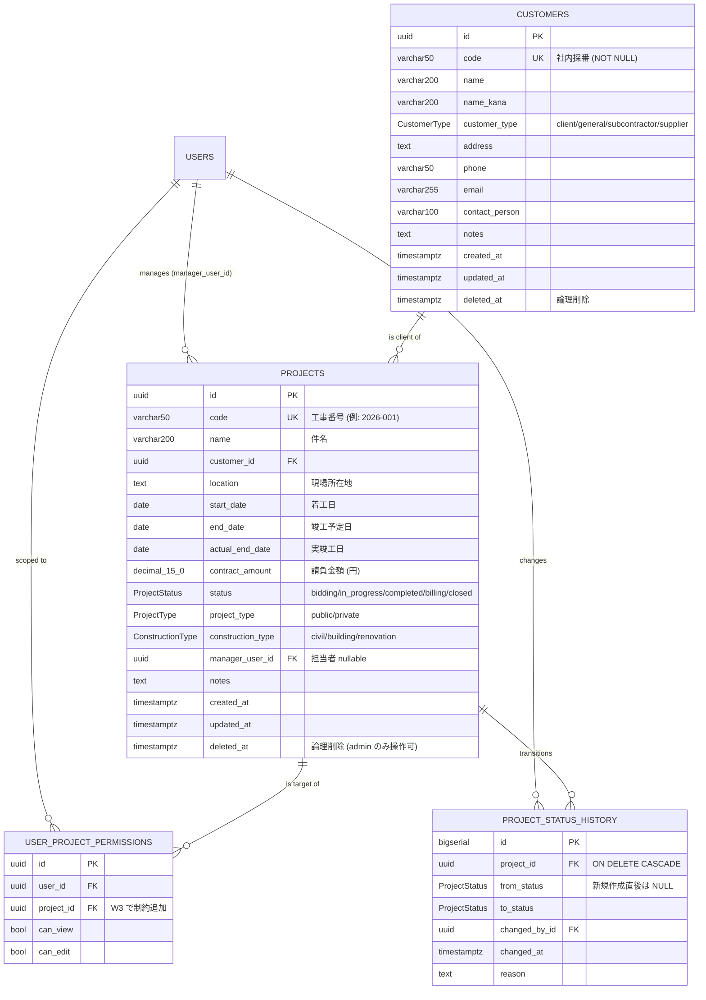

# データモデル — 取引先・工事 (W3)

W3 (T14) で追加されたテーブル群の参照ドキュメント。
正本は [`apps/api/prisma/schema.prisma`](../apps/api/prisma/schema.prisma)、
マイグレーションは `apps/api/prisma/migrations/20260516094205_add_customers_projects_and_status_history/`。

---

## ER 図

---

## テーブル詳細

### `customers`
取引区分は `CustomerType` enum で `client` / `general` / `subcontractor` / `supplier` の 4 値。
**`code` は NOT NULL + UNIQUE**（ユーザ確定: 他システム連携キーとして必須運用）。

### `projects`
| カラム | 型 | 補足 |
|---|---|---|
| `code` | varchar(50) UK | 工事番号 (例: `2026-001`) |
| `name` | varchar(200) | 件名 |
| `customer_id` | uuid FK→customers | |
| `location` | text? | 現場所在地 |
| `start_date` / `end_date` / `actual_end_date` | date? | |
| **`contract_amount`** | **decimal(15,0)** | **円単位、Prisma Client は Decimal、API は string で返却** |
| `status` | `ProjectStatus` | デフォルト `bidding` |
| `project_type` | `ProjectType` | public / private |
| `construction_type` | `ConstructionType` | civil / building / renovation |
| `manager_user_id` | uuid? FK→users | `ON DELETE SET NULL` |
| `notes` | text? | 備考・連絡事項 |
| `deleted_at` | timestamptz? | 論理削除 (admin 専用) |

インデックス: `customer_id`, `manager_user_id`, `status`, `deleted_at`。

### `project_status_history`
- `bigserial` PK (件数増を想定)
- `from_status` は新規作成時のみ NULL、それ以外は前状態
- **後戻り遷移を許容** (DB / Service 層に制約なし)。`closed → in_progress` などは UI 側で警告（建設業の追加工事・手戻りに対応）
- `ON DELETE CASCADE`: project が論理削除でも履歴は残るが、物理削除した場合は履歴も消える

### `user_project_permissions` (W2 で先行投入、W3 で FK 制約追加)
- `project_id` に `REFERENCES projects(id) ON DELETE CASCADE` を追加（同マイグレーション内で実施）
- `(user_id, project_id)` UNIQUE は既存のまま

---

## 認可ポリシー（T16 で実装、ここでは方針のみ）

| ロール | View（閲覧） | Edit（編集） | Delete |
|---|---|---|---|
| `admin` | 全工事 (バイパス) | 全工事 (バイパス) | **可** |
| `accounting` | **全工事 (バイパス)** | 不可（ABAC 経由不可）※ | 不可 |
| `planner` | manager本人 ∪ UPP.can_view | manager本人 ∪ UPP.can_edit | 不可 |
| `field` | UPP.can_view | UPP.can_edit | 不可 |
| `viewer` | UPP.can_view | 不可 | 不可 |

> **ユーザ確定事項**:
> - `accounting` は **閲覧のみバイパス**。編集は ABAC 経路すら通さない（経理は基本情報・実行予算を編集しない運用）。
> - `delete` は **admin のみ**。manager 本人でも不可（原価・支払データへの波及を完全管理）。

---

## ステータス遷移ルール

DB / Service 層では **遷移制約なし** (ユーザ確定: 建設業の手戻り・追加工事に対応するため自由遷移を許容)。
UI 側で「completed → in_progress に戻します。本当によろしいですか?」のような警告ダイアログを出す方針。

---

## seed 内容（dev 環境）

`pnpm --filter @kgk/api db:seed` で投入される dev 用サンプル:

| customers | code | name | customer_type |
|---|---|---|---|
| 1 | `C0001` | 株式会社サンプル工務店 | general |
| 2 | `C0002` | 〇〇市役所 | client |

| projects | code | name | status | contract_amount | type |
|---|---|---|---|---:|---|
| 1 | `2026-001` | 〇〇ビル新築工事 | `in_progress` | 250,000,000 | private/building |
| 2 | `2026-002` | 駅前広場改修工事 | `bidding`     |  48,000,000 | public/renovation |

manager は seed 上の admin (`admin@kgk.local`)。本番 seed には含めない。

---

## マイグレーション運用

- 開発: `pnpm --filter @kgk/api exec prisma migrate dev --name <english_snake_case>`
- 本番: `prisma migrate deploy`
- W3 で追加: `20260516094205_add_customers_projects_and_status_history`
  - 4 enum (CustomerType / ProjectStatus / ProjectType / ConstructionType)
  - 3 テーブル (customers / projects / project_status_history)
  - `user_project_permissions` への FK 制約追加
